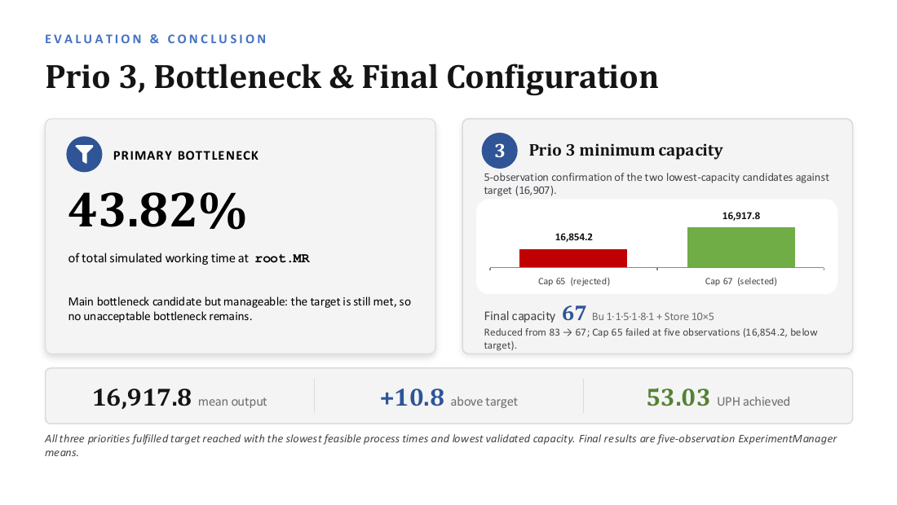
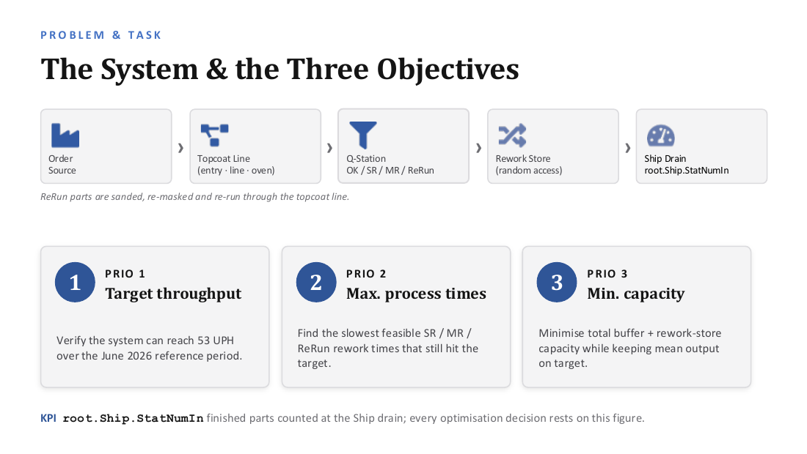
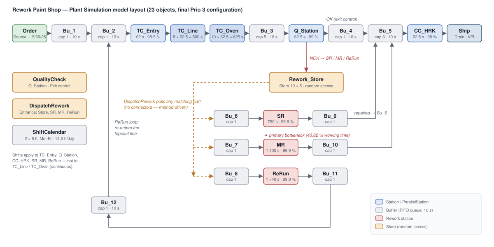
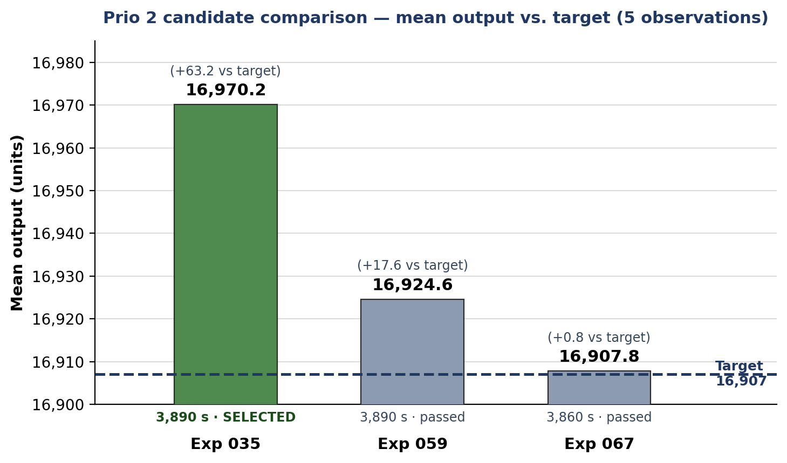
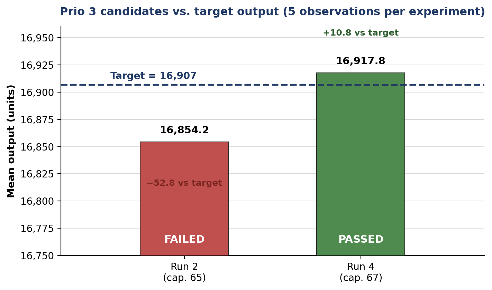
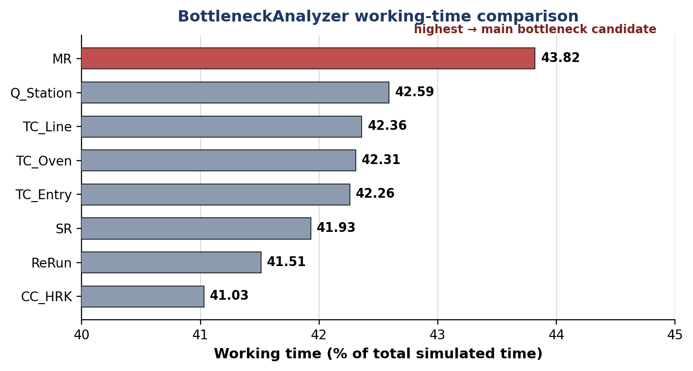
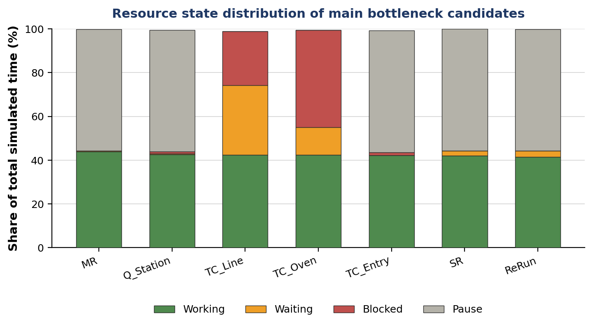

# Rework Paint Shop — Simulation Study

A discrete-event simulation study of an **automotive rework paint-shop area**, built in
**Siemens Tecnomatix Plant Simulation 2404** and structured according to the **VDI 3633**
procedure for simulation studies.

The study answers three questions, in order: *can the line hit its throughput target*,
*how slow may the rework stations be and still hit it*, and *how little buffer capacity does
it need*. All three were answered with `ExperimentManager` runs of five observations each.

> Logistic Simulations · Summer Semester 2026 · Rhine-Waal University of Applied Sciences
> B.Sc. Mobility and Logistics · Group 5

---

## Results at a glance

| | Target | Achieved | Margin |
|---|---|---|---|
| **Throughput** | 16,907 parts | **16,917.8** (5-obs. mean) | +10.8 |
| **Rate** | 53.00 UPH | **53.03 UPH** | +0.03 |
| **Total rework process time** (maximise) | — | **3,890 s** | +300 s over the safe start |
| **Total capacity** (minimise) | — | **67 places** | reduced from 83 |

The primary bottleneck is `root.MR` at **43.82 %** of total simulated working time — high, but
the target is still met, so no unacceptable bottleneck remains.



---

## The system



Parts are created in three colours, run through the topcoat line, and are inspected at the
Q-Station. Each part is then classified **OK**, **SR** (small rework), **MR** (medium rework)
or **ReRun**. Anything that is not OK goes into a random-access rework store; ReRun parts are
sanded, re-masked and sent back through the topcoat line. Finished parts are counted at the
Ship drain.

**KPI:** `root.Ship.StatNumIn` — every optimisation decision in this study rests on that figure.

### Model layout



23 objects: 1 Source, 12 Buffers, 6 Stations, 2 ParallelStations, 1 Store, 1 Drain,
plus 2 SimTalk Methods and a ShiftCalendar.

### Input data

**Colour mix** — red 15 %, white 60 %, black 25 %.

**Rework probability at the Q-Station** (colour-dependent, which is why the routing needed a
Method — the built-in *Percentage* exit strategy cannot express per-colour probabilities):

| Colour | SR | MR | ReRun | OK |
|---|---|---|---|---|
| red | 7 % | 2 % | 1 % | 90 % |
| white | 9 % | 6 % | 5 % | 80 % |
| black | 8 % | 3 % | 2 % | 87 % |

**Stations**

| Object | Type | Capacity | Process time | Availability | MTTR |
|---|---|---|---|---|---|
| `TC_Entry` | Station | 1 | 62 s | 98.5 % | 600 s |
| `TC_Line` | ParallelStation | 8 | 500 s (8 × 62.5) | 99.0 % | 600 s |
| `TC_Oven` | ParallelStation | 10 | 625 s (10 × 62.5) | 99.5 % | 1800 s |
| `Q_Station` | Station | 1 | 62.5 s | 99.0 % | 600 s |
| `CC_HRK` | Station | 1 | 62.5 s | 98.0 % | 600 s |
| `SR` / `MR` / `ReRun` | Station | 1 | *Prio 2 variables* | 99.9 % | 600 s |

Modelling the topcoat line as a ParallelStation of capacity 8 × 62.5 s reproduces the real
behaviour exactly: each part stays 500 s inside, and one part leaves every 62.5 s.

**Shift model** — two 8 h shifts, Mo–Fr, applied to `TC_Entry`, `Q_Station`, `CC_HRK`, `SR`,
`MR` and `ReRun`. `TC_Line` and `TC_Oven` run continuously.

| Shift | Working time | Pauses |
|---|---|---|
| 1 | 06:00 – 14:00 | 09:00–09:15, 12:00–12:30 |
| 2 | 14:10 – 22:10 | 18:10–18:40, 20:30–20:45 |

That gives **14.5 productive hours per day**, so the target follows as
22 working days × 14.5 h × 53 UPH ≈ **16,907 parts**.

---

## Model implementation

Two SimTalk methods carry the entire rework dynamic. Both are in
[`src/simtalk/`](src/simtalk/) as readable source.

### [`QualityCheck`](src/simtalk/QualityCheck.simtalk) — exit control of `Q_Station`

Draws a random number, compares it against that colour's probabilities, writes the result into
the part's `QualityState` attribute, and routes the part to `Bu_4` (OK) or `Rework_Store` (NOK).
The `waituntil … prio 1` guards keep a part on the station while its target is full and release
it the instant space frees up — realistic blocking rather than a deadlock.

### [`DispatchRework`](src/simtalk/DispatchRework.simtalk) — random-access dispatcher

Parts in a `Store` never move on by themselves, so a method pulls them out. This is what makes
the rework store genuinely **random access** rather than FIFO: the dispatcher scans the store
and moves any part whose lane is free — SR → `Bu_6`, MR → `Bu_7`, ReRun → `Bu_8`.

It is hooked to the *Entrance* control of `Rework_Store`, `SR`, `MR` and `ReRun` — the only two
moments anything can change are a part arriving in the store and a station freeing its lane.

There are deliberately **no connectors** from `Rework_Store` to `Bu_6`/`Bu_7`/`Bu_8`; leaving
them out makes it structurally impossible for a part to escape into the wrong lane.

---

## The three priorities

### Prio 1 — verify the target throughput

A rough analytical estimate came first. About 3.65 % of inspected parts are ReRuns that travel
the loop a second time, so the topcoat line must handle ≈ 53 / 0.9635 ≈ **55 parts gross per
hour**. Its 62.5 s takt allows 57.6/h before failures — feasible, but tight, which is exactly
why the buffer sizes and rework takts matter.

Run with safe starting times **SR 700 s / MR 1,270 s / ReRun 1,620 s** (3,590 s total):

**17,319 parts** in a single run — **+412 above target**, 54.29 UPH. Target confirmed achievable.

### Prio 2 — maximise the rework process times

The theoretical upper bounds followed from the weighted rework arrival rates
(SR ≈ 775 s, MR ≈ 1,405 s, ReRun ≈ 1,790 s). Those are upper bounds that randomness eats into,
so the search started 10 % lower and stepped up in 30 s increments until throughput broke — a
coarse screening run to locate the feasible region, then a refined run to narrow the boundary.



**Selected: Exp 035** — SR **750 s**, MR **1,400 s**, ReRun **1,740 s** (3,890 s total),
mean output **16,970.2** (+63.2, 53.20 UPH). The highest feasible total process time.

### Prio 3 — minimise the buffer and store capacity

Only after Prio 1 and 2 were settled. Capacities were reduced one at a time and re-validated
against the acceptance rule (mean of 5 observations ≥ 16,907).



Capacity **65 was rejected** — it passed on a lucky single run but its five-observation mean was
16,854.2, i.e. 52.8 *below* target. Capacity **67 was accepted** at 16,917.8.

**Final capacity 67**, reduced from 83:

| `Bu_1` | `Bu_2` | `Bu_3` | `Bu_4` | `Bu_5` | `Bu_12` | `Rework_Store` | **Total** |
|---|---|---|---|---|---|---|---|
| 1 | 1 | 5 | 1 | 8 | 1 | 10 × 5 = 50 | **67** |

`Bu_6`–`Bu_11` are fixed at capacity 1 by the task; every buffer has a 10 s dwell time per place.

---

## Bottleneck analysis





`MR` carries the highest working-time share and is the main bottleneck candidate. The state
distribution explains the rest of the system: `TC_Line` and `TC_Oven` show substantial
**blocked** and **waiting** shares because they run continuously while the six shift-bound
stations pause — they are throttled by the shift model, not by capacity. The shift-bound
stations sit at roughly 42 % working / 56 % pause, which is the 14.5 h of 24 h duty cycle.

---

## Verification and validation

- **Material flow traced part-by-part** — OK path → cavity conservation → Ship; rework path →
  store → matching station; ReRun path → loop back into the topcoat line. Routing matches the task.
- **Warm-up handled** by simulating 5 weeks so the empty first day barely affects the statistics.
- **No single-seed decisions.** Every accept/reject rests on the five-observation mean, which is
  what caught the capacity-65 candidate that passed on one run and failed on the mean.
- Throughput judged **per day**, not per calendar hour, since six stations follow the shift calendar.

---

## Repository contents

```
├── models/
│   ├── Prio1_target_throughput.spp      Prio 1 model — target verification
│   └── Prio3_final_configuration.spp    Final model — Prio 2 times + Prio 3 capacities
├── src/simtalk/
│   ├── QualityCheck.simtalk             Q_Station exit control (colour-dependent routing)
│   └── DispatchRework.simtalk           Random-access rework store dispatcher
├── data/
│   └── parameters-exam-task-G5.xlsx     Given input parameters
├── results/
│   ├── experiment-manager-report.html   ExperimentManager output
│   ├── experiments-raw.xlsx             Raw experiment table
│   └── figures/                         Charts and diagrams used above
└── docs/
    └── model-build-guide.md             Click-by-click rebuild guide for the whole model
```

## Opening the models

The `.spp` files need **Siemens Tecnomatix Plant Simulation 2404** or newer (Windows only; a
free Student Edition is available from Siemens). Open
`models/Prio3_final_configuration.spp`, double-click the `EventController`, press **Reset**,
then **Start**. Read the result at `Ship` ▸ *Statistics*.

To rebuild the model from scratch, [`docs/model-build-guide.md`](docs/model-build-guide.md)
walks through every object, value and connection.

Note that `.spp` files are binary — Git stores them fine but cannot diff or merge them, so
treat each commit of a model as a full snapshot.

---

## Method

The study follows the **VDI 3633** phase structure: task definition and target system, system
analysis, data collection and preparation, conceptual model, model implementation, verification
and validation, experiment planning, simulation experiments, evaluation, and documentation.

VDI 3633 Part 1 is a copyrighted standard and is **not redistributed in this repository**; it is
cited as the methodological reference only.

The written study report and the final presentation are **not published here** — they carry the
group members' personal university details. The results, figures and reasoning they contain are
reproduced in this README; the documents themselves are available on request.

## Authors

**Group 5** — Tarek Hasan · B M Muntasir Fahim · Gazi Alvi Junaid
Rhine-Waal University of Applied Sciences, B.Sc. Mobility and Logistics.

Academic coursework, published for reference and portfolio purposes. Please cite the authors if
you build on the model or the study.
